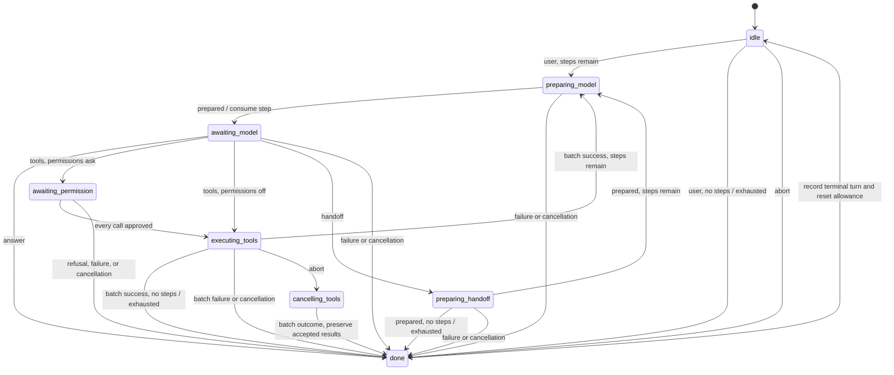
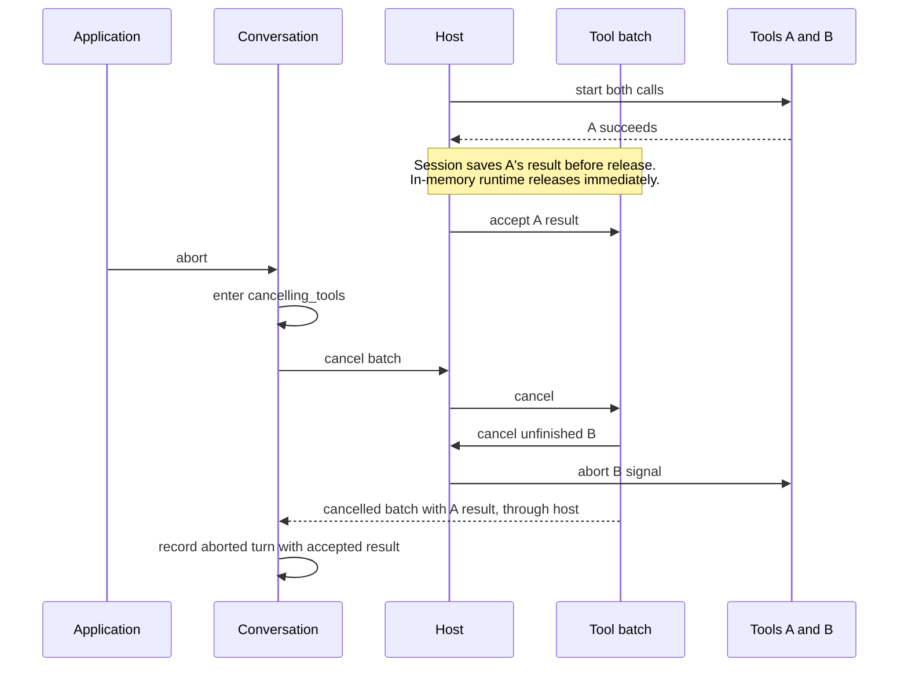
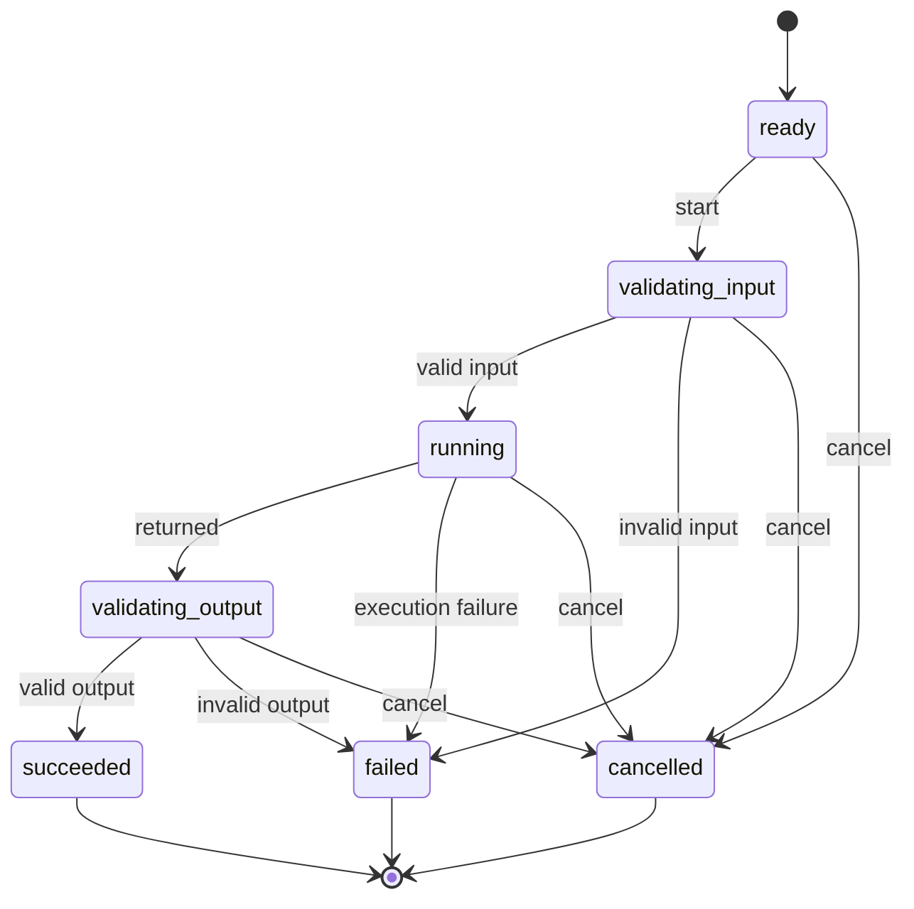

# Operation identity and cancellation

These diagrams explain actor behavior shared by both runtimes. Actor commit installs immutable
state; it does **not** mean journal persistence. The session adds the
[receipt gates](session-runtime.md) before commands execute. Dashed returns below are outcomes,
not permission to bypass those gates.

## A turn has a permission phase



Replacement input is omitted from this diagram for readability; the sequence below covers it.
Permission refusal fails the whole turn before any tool starts. Permission-dialog cancellation
aborts it. The distinction must survive into a client-facing result.

## Replace model work without accepting its late answer

```mermaid
sequenceDiagram
  participant A as Application
  participant C as Conversation
  participant H as Shared host
  participant O as Old operation
  participant N as New operation
  A->>C: replacement user input
  C->>C: install new child identity in the same turn
  C->>H: cancel old child; start replacement
  H->>O: abort signal
  H->>N: start
  N-->>H: result for new child
  H-->>C: correlated outcome
  C->>C: accept matching turn and child
  O-->>H: late result, if adapter ignored signal
  H->>H: ignore already-cancelled operation result
  Note over C,H: Conversation also rejects mismatched turn or child identities.
```

Both inputs settle with the same terminal turn. Under the default policy, replacement applies to
preparation/completion/handoff, not tool or permission work. A timeout uses the same cancellation
machinery with a distinct typed reason; it does not spawn a replacement automatically.

## Cancelling a batch preserves what was accepted



Tool B may already have changed an external service. Its cancellation is not proof that nothing
happened. On failure, unfinished siblings receive the initiating call's cause so the public outcome
and logs can explain why the rest of the batch stopped.

## An operation settles once



Cancellation carries a reason. The surrounding host/turn translates a timeout reason into a failed
terminal outcome with classification `timeout`; user cancellation remains distinguishable. A
terminal actor does not accept a late success. Keep arbitrary Error objects and AbortControllers
outside snapshots; retain serializable causes and operation identity inside outcomes.
