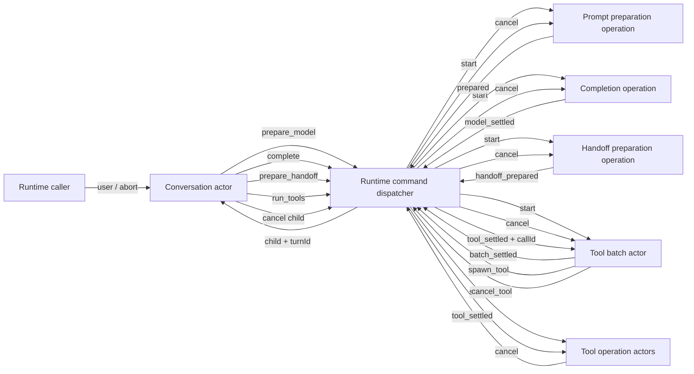
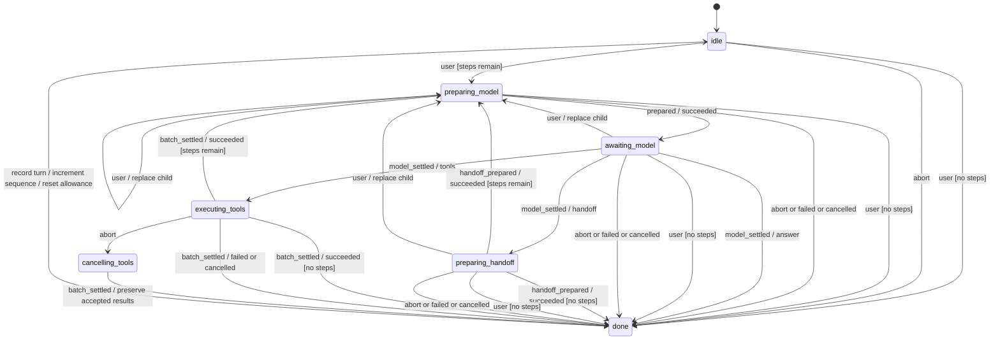
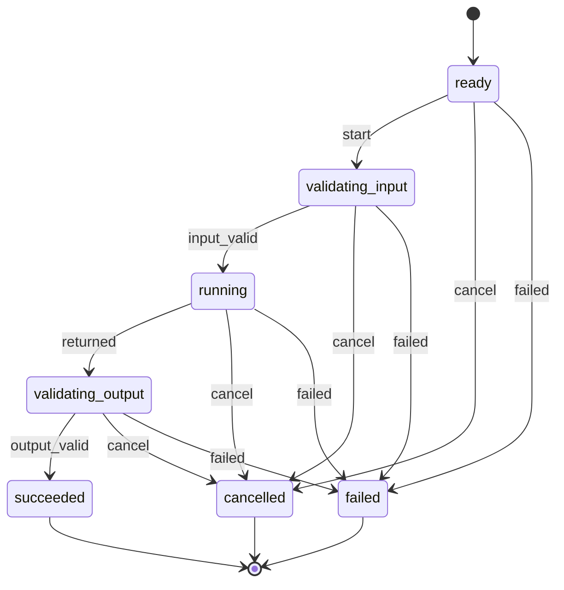
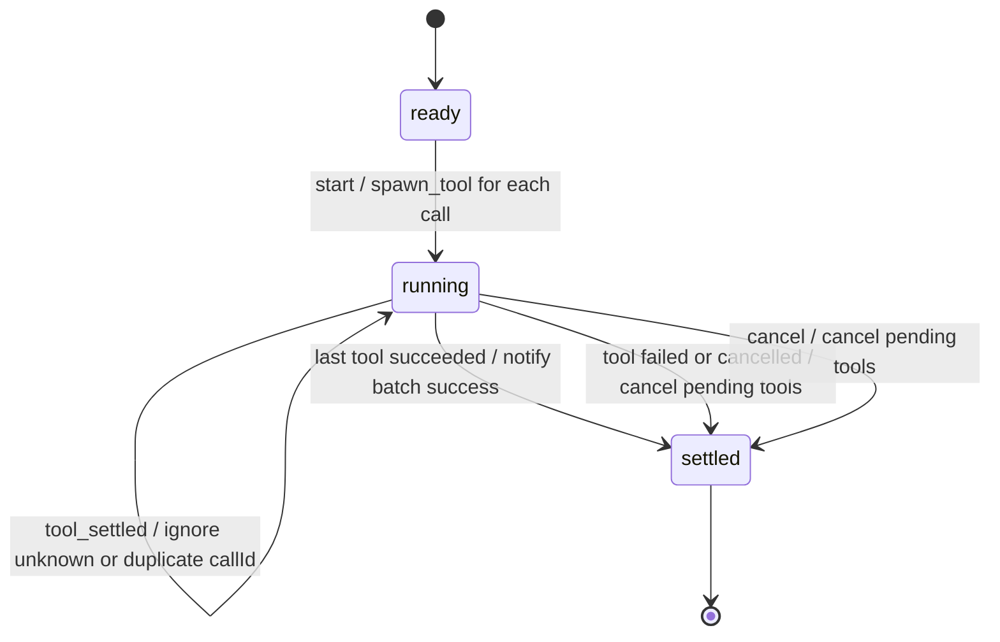
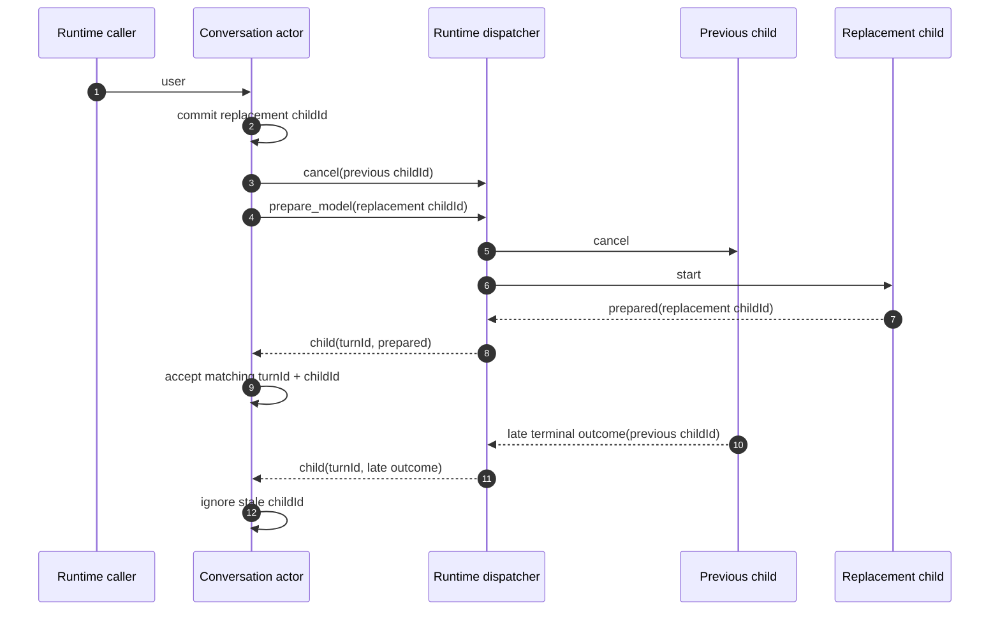
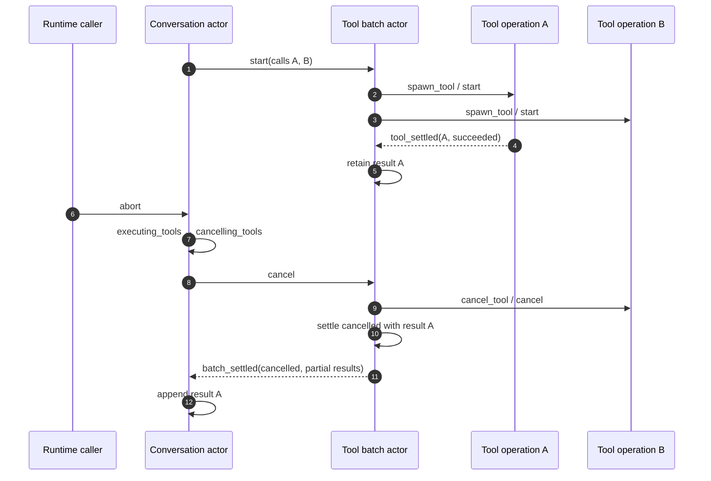
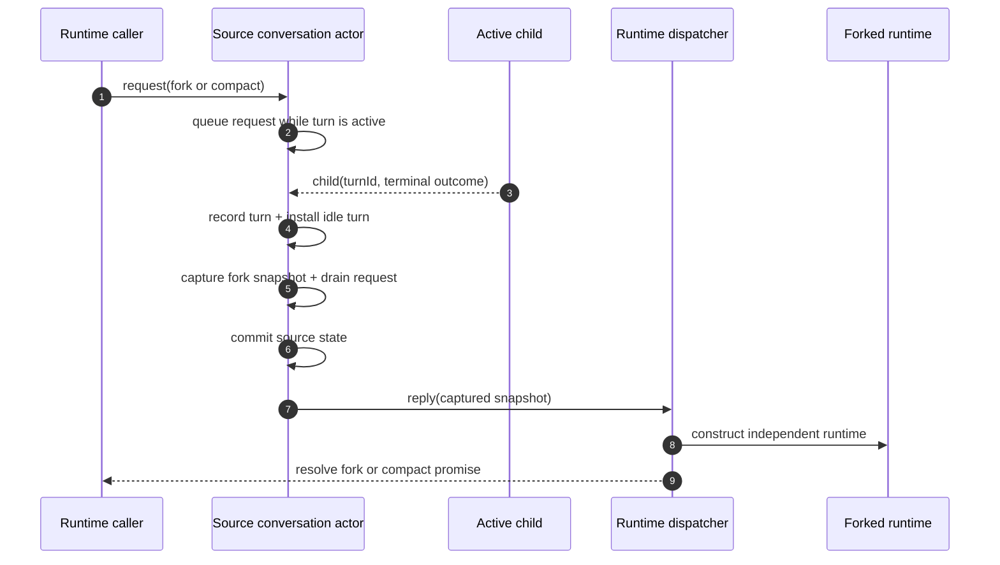

# Agent flow diagrams

Supplementary visuals for [`core-runtime.md`](./core-runtime.md).

## Message routing

## Turn state transitions

## Operation actor transitions

## Tool batch transitions

## Barge-in and stale outcomes

## Tool cancellation with partial results

## Fork publication boundary

