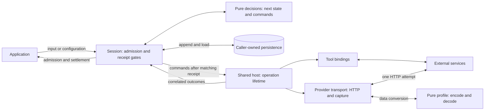
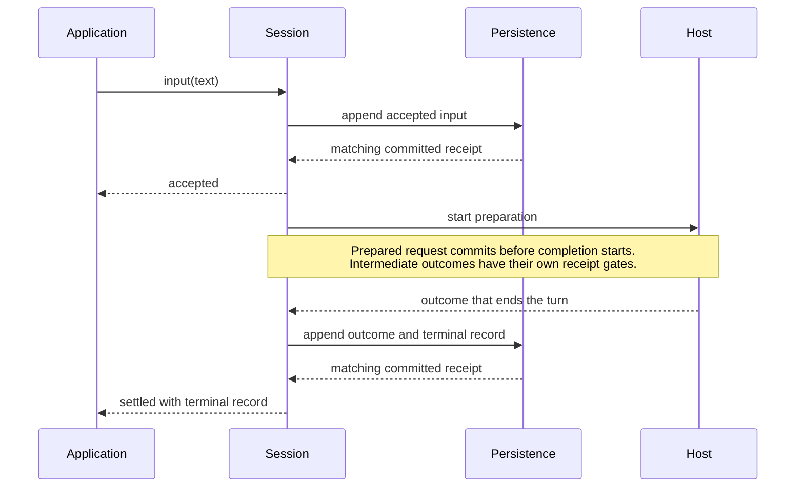
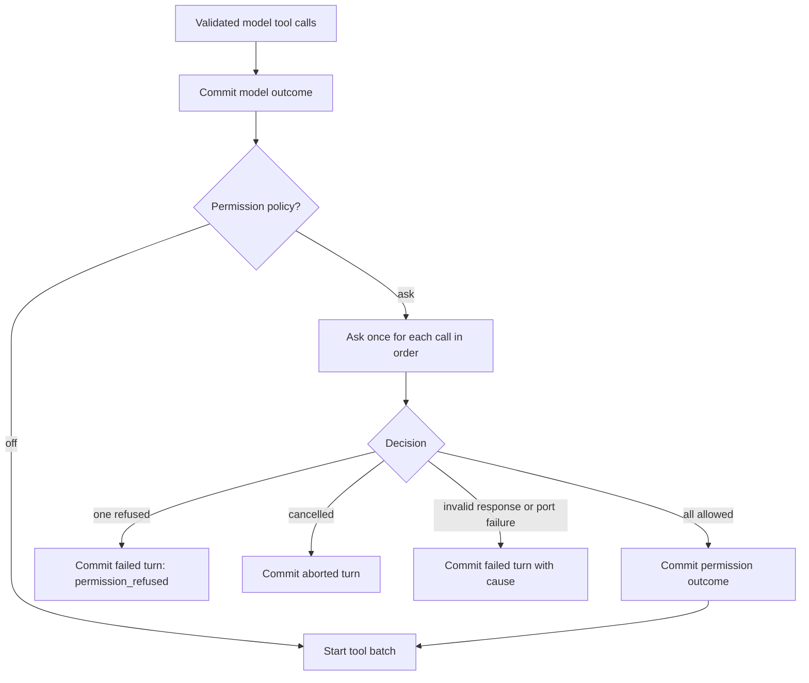
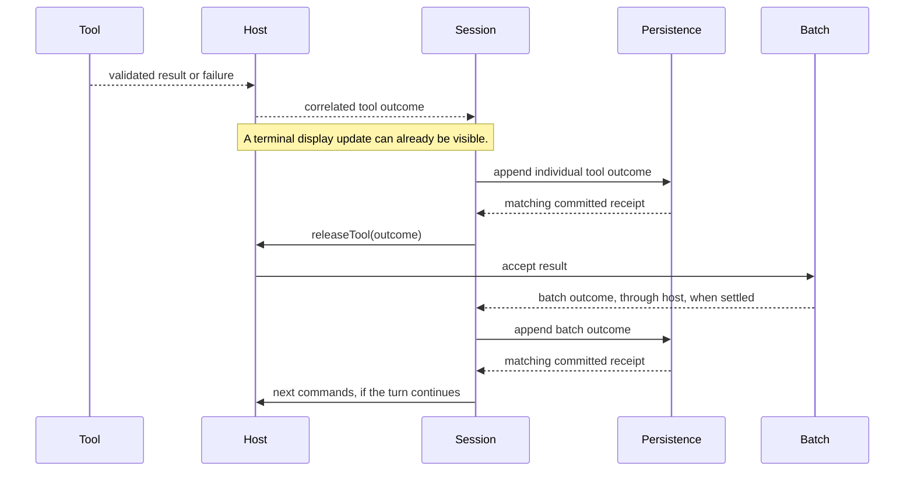
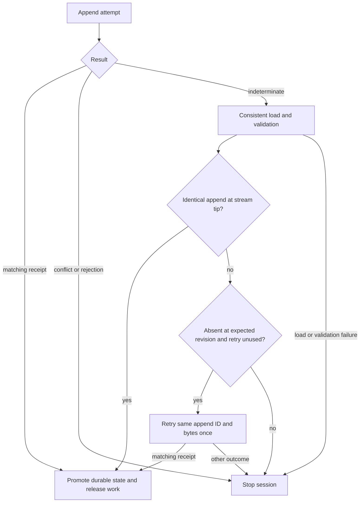
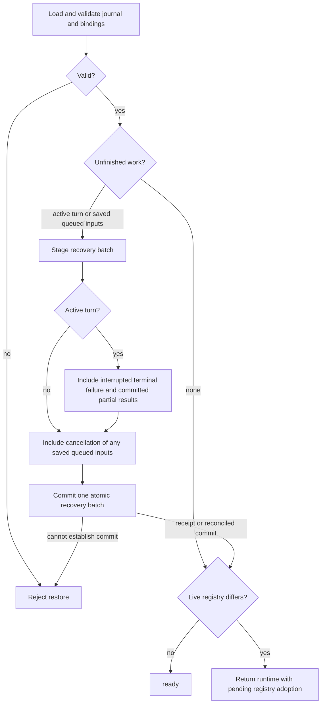
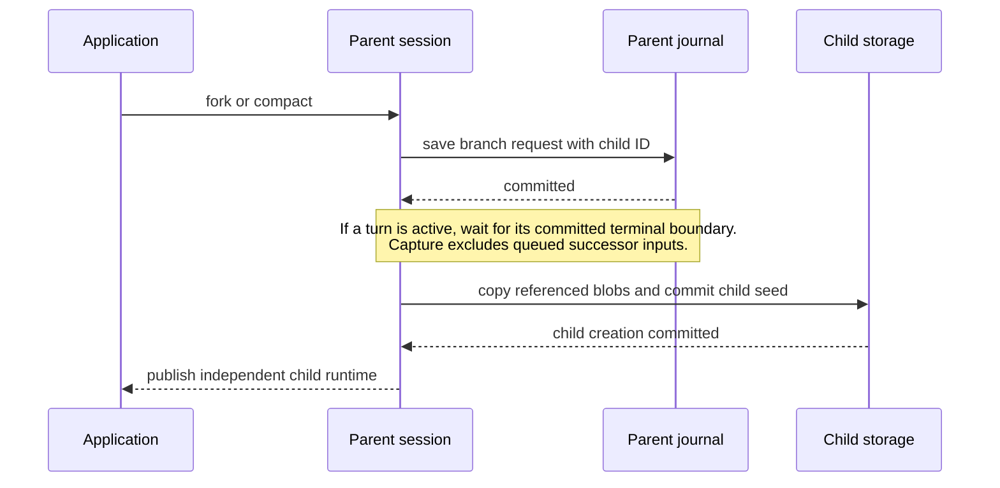
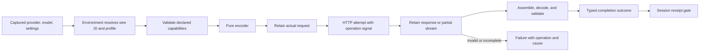

# Where a session's guarantees come from

A session joins two systems that cannot share a transaction: its journal and the outside world.
The journal can prove that a tool was authorized and that a result was saved. It cannot prove that
an interrupted external write did not happen. The design therefore commits before releasing work
and stops interrupted work on restore instead of replaying it.

These diagrams show the boundaries an integrator must preserve. They omit mailbox plumbing;
[core actor diagrams](agent-flow-diagrams.md) cover replacement and cancellation inside a turn.

## Keep execution, decisions, and storage separate



Profiles cannot fetch, and decisions cannot perform I/O. This separation lets replay reconstruct
state without touching an external service. Bindings and credentials remain environment resources;
they must be supplied again on restore.

## Admission and settlement answer different questions



The two arrows following a receipt express eligibility, not a promise about callback scheduling.
Await admission to know input was saved; await settlement to learn how it ended. Neither a resolved
promise nor a display notification implies a successful answer. Inspect the returned discriminants.

## Permission must precede the whole batch



No tool runs while the batch is waiting. Approval of call A does not allow A to start while call B
is still undecided. A notification showing a pending tool is display evidence only. Permission
waiting has no core timeout; the caller may cancel it.

## Save each tool result before continuing



Saving only the final batch would lose completed siblings if another tool hangs or the process
stops. A durable partial result remains available for recovery even when the batch never completes.
The batch may settle early on failure/cancellation; it does not always wait for every tool to succeed.

## A lost receipt is uncertainty, not failure



Only the storage append is retried. No completion or tool is repeated. The persistence adapter must
ensure a request cannot commit later after a consistent load reports it absent. Otherwise the
runtime cannot safely decide whether dependent work may start. Close or AbortSignal cancellation
alone is also not a storage result; restore after close to discover a dispatched append's outcome.

## Input waiting and configuration are different cases

A storage append can temporarily queue submissions in memory; that queue is lost on process exit.
A `queue-user` policy instead saves user input for a later turn. Do not label both as “accepted”:
only the receipt establishes durable admission.

System/policy changes return `busy` while a turn or durable queued input is outstanding, including
staged active work. This check happens before ordinary transient queueing. Wait for the existing
work to drain, commit the change, then submit the next input. Active work retains its captured
configuration; configuration changes do not change the journal format.

## Restore inspects history and closes interrupted work



An idle session with only queued inputs gets cancellations, not an invented failed turn. None of
these paths invokes completion, tool, or permission bindings. Blob bytes are read only when needed
for later work, so restoration is not a test of attachment availability. Repeating an uncertain
action requires a new explicit invocation after restoration.

## Restore adopts the live registry and bindings

Stored history is a record of what happened, not a constraint on what may happen next. Replay
validates committed records structurally (schema, version sequence, patch-derived policies, prompt
captures against their projection) but never asks whether a provider, model, profile setting or
permission port named in them is bound today. New policy patches are still validated against live
bindings before they are admitted.

If the live agents or tool schemas differ from the journal's registry, or the current policy does
not validate against the live bindings, restore still succeeds and reports
`registry: { kind: "pending_adoption", differences }`; `session.policy` is the policy the next turn
will use. Tool differences name the schema delta, e.g. `changed tools.read_file.parameters: added
properties line, limit`. Opening writes nothing beyond a recovery batch. The first input, system or
policy change, fork or compaction first appends a `configuration` record with stable ID
`configuration/<sessionId>/<revision>`, then the work queues behind it:

```mermaid
sequenceDiagram
  participant A as Application
  participant S as Session
  participant J as Journal
  A->>S: input
  S->>J: configuration (live registry, reconciled policy/agent)
  J-->>S: committed
  S->>J: user input
  J-->>S: committed
  S-->>A: turn runs with live tools; registry is current
```

Replay validates prompt captures before that record against the old registry and later ones against
the new registry. The record replaces the registry and, only when needed, reconciles:

- `policy`: a new policy version. Per-agent tool permissions drop unregistered tools and removed
  agents; new agents are derived as creation does. Provider, model, thinking, thinking budget,
  stream, output limit and permission mode that the live bindings reject are replaced by the policy
  a new session would get, changing the fewest fields (the saved provider/model is kept when some
  combination allows it). No other policy field may change; the result is validated.
- `agent`: the live default agent, only when the idle conversation's agent is no longer registered.

A changed model or agent is logged as a `session.registry.reconciled` warning with the previous and
next values and the consequence (for example `next turn uses anthropic/claude-opus-4-5`).

History is never filtered or rewritten. The next prompt projects every earlier message, including
calls to and results from tools that are no longer registered, and advertises only live tools. If
the adoption append fails, the session fails and queued work settles with that storage cause.

## Branch publication has two persistence boundaries



A fork retains history; compaction uses your replacement context. Neither copies live operations or
mutates the parent. There is no transaction across parent and child streams. If publication is
interrupted, inspect the saved child ID and restore it rather than issuing another fork blindly.

## Model selection and observable traffic



The capture sink is environment-owned and opt-in. A successful response is not required to retain
the offending body: JSON parse failures and stream EOF leave evidence. Capture is separate from
normal diagnostic logs and from the journal; each answers a different question. See
[logging](../packages/core/logging/README.md) and [capture setup](../packages/core/environment/README.md).
