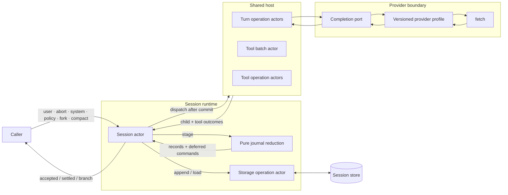
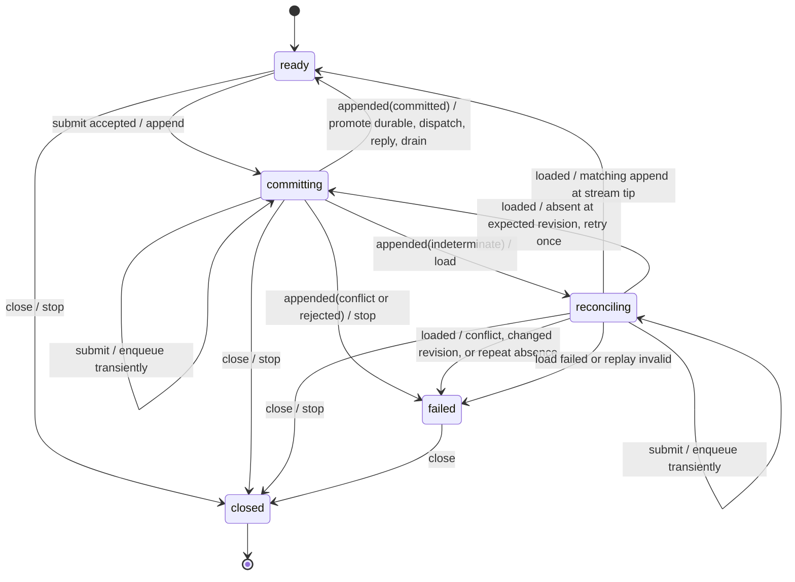
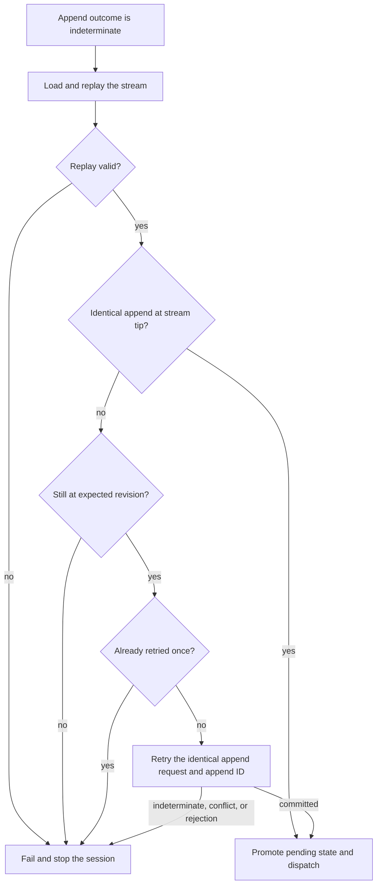
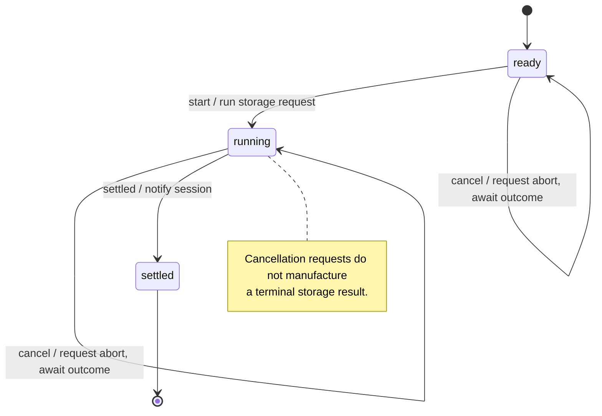
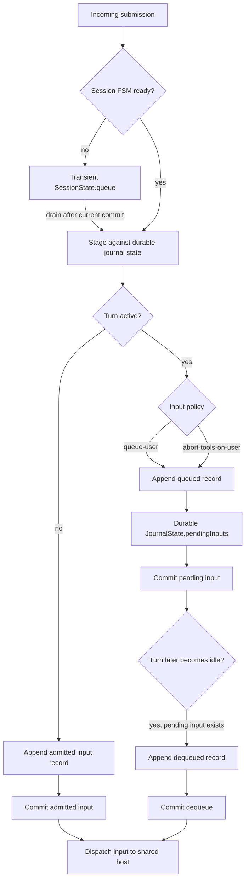
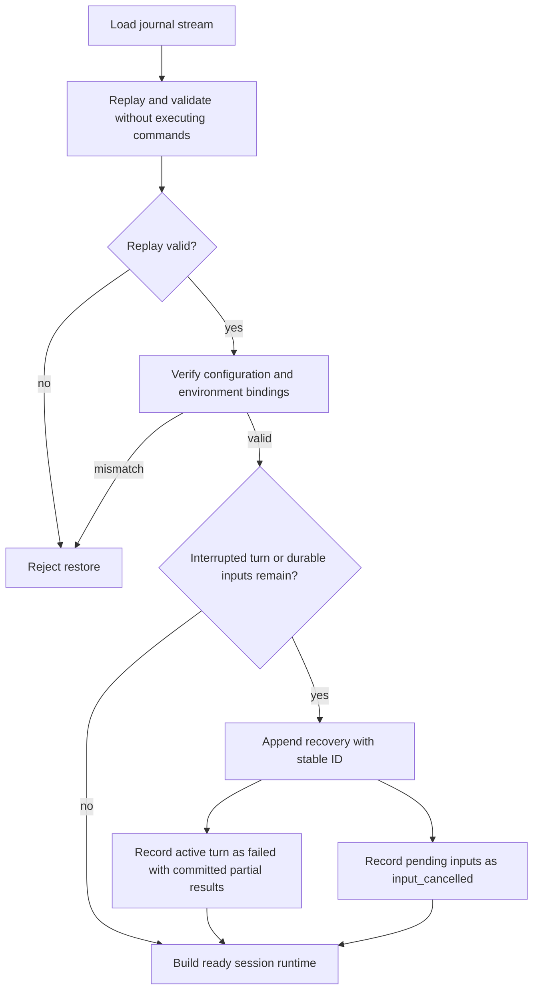

# Session runtime flows

These diagrams supplement the session [module guide](../packages/core/session/README.md) and
the existing [agent flow diagrams](./agent-flow-diagrams.md).

## Runtime topology



## Session state transitions



## Commit before dispatch and settlement

```mermaid
sequenceDiagram
  autonumber
  participant C as Caller
  participant S as Session actor
  participant J as Journal reduction
  participant O as Storage operation
  participant P as Persistence port
  participant H as Shared host

  C->>S: dispatch(user)
  S->>J: stage(durable, submission)
  J-->>S: next state + records + deferred commands
  S->>S: enter committing with pending next state
  S->>O: append(request)
  O->>P: append(records, expected revision)
  P-->>O: committed(receipt)
  O-->>S: appended(committed)
  S->>S: validate receipt; durable := pending.next
  S->>H: dispatch deferred conversation commands
  S-->>C: accepted

  H-->>S: terminal child outcome
  S->>J: stage terminal event
  J-->>S: terminal record + next idle turn
  S->>O: append(terminal batch)
  O->>P: append(records, expected revision)
  P-->>O: committed(receipt)
  O-->>S: appended(committed)
  S->>S: commit terminal record
  S-->>C: settled
```

## Indeterminate append reconciliation



## Individual tool-result commit gate

```mermaid
sequenceDiagram
  autonumber
  participant T as Tool operation
  participant H as Shared host
  participant S as Session actor
  participant P as Persistence port
  participant B as Tool batch actor

  T-->>H: tool outcome
  H->>S: submit tool(turnId, batchId, callId, result)
  S->>S: validate identities; stage tool record
  S->>P: append(tool record)
  P-->>S: committed
  S->>S: promote durable journal state
  S->>H: releaseTool(outcome)
  H->>B: tool_settled(callId, result)

  alt More calls remain
    B->>B: retain result and continue
  else Batch settles
    B-->>H: batch_settled
    H->>S: submit child(turnId, batch_settled)
    S->>P: append(batch outcome)
    P-->>S: committed
    S->>H: dispatch next conversation commands
  end
```

## Storage-operation cancellation



## Transient and durable input queues



## Restore and recovery



## Persisted fork and compaction boundary

```mermaid
sequenceDiagram
  autonumber
  participant C as Caller
  participant P as Parent session
  participant PS as Parent stream
  participant CS as Child stream
  participant R as Child runtime

  C->>P: fork or compact
  P->>PS: append parent request and boundary
  PS-->>P: committed
  P->>P: commit parent transition; capture exact boundary
  P->>CS: append initialize(childId, seed)
  CS-->>P: committed
  P->>R: build from committed child seed
  P-->>C: publish child session

  Note over PS,CS: Separate streams; no cross-stream atomic transaction
  Note over P,R: Child inherits neither live work nor pending inputs
```

## Provider completion boundary

```mermaid
flowchart LR
  host[Host completion operation actor]
  port[Bound CompletionPort]
  select{request.provider}

  subgraph profiles[Pure versioned profiles]
    openai_chat[openai-chat@1]
    openai_responses[openai-responses@1]
    anthropic[anthropic-messages@1]
    google[google-generate@1]
  end

  transport[HTTP transport]
  fetch[fetch: one attempt + AbortSignal]
  admission[Host completion admission]
  outcome[model_settled]
  gate[Session journal append gate]

  host --> port --> select
  select --> openai_chat
  select --> openai_responses
  select --> anthropic
  select --> google
  openai_chat -->|encode| transport
  openai_responses -->|encode| transport
  anthropic -->|encode| transport
  google -->|encode| transport
  transport --> fetch --> transport
  transport -->|decode with selected profile| admission
  admission --> outcome --> gate
```
